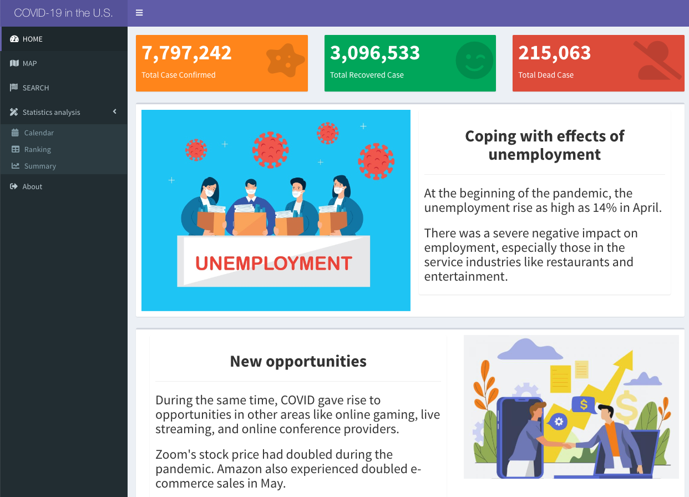

# Project 2: Shiny App Development

### [Project Description](doc/project2_desc.md)




## Covid-19 in the U.S.
Term: Fall 2020

+ **Projec title: Finding a job under COVID-19 in the US**
+ [Shiny Link](XXX)
+ Team #5 
+ Team members:
	+ Citina Liang (Presenter)
	+ Xiangning Han
	+ Henan Xu

+ **Project summary**: 

In this project, we developed a user-friendly dashboard with the Shiny app to help people better understand the current situation about the pandemic and the unemployment rate in different states in the US. Users of this dashboard can discern the differences between unemployment statistics in different states. At the same time, they can also use the COVID statistics to gauge the severity of the pandemic in those respective states.

As the interactive map changes with time, we can build up insights into the Covid-19 pandemic dynamics in the United States. Handy observations, such as which states suffered most during the initial outbreak of the pandemic, implemented effective procedures to contain the disease's spread and which did not, which stated had and grew considerable testing hospitalization capacity. All this information could be of great help to the government, organizations, and companies. 

+ **Data Source**: [JHU CSSE Covid-19 Data](https://github.com/CSSEGISandData/COVID-19/tree/master/csse_covid_19_data) 

+ [**Contribution statement**:](doc/a_note_on_contributions.md)

Citina Liang carried out data-preprocessing for both covid19 data and unemployment data, designed the layout of the app, designed and developed an informative Home page with text and graphs, designed and built the Search page with interactive comparable plots, improved the About page, wrote the project summary and readme page.

Henan Xu participated in group discussions throughout the process, brainstormed ideas about the contents and layout of the project, helped in debugging the app, and was responsible for designing and coding up the interactive map.

Xiangning Han analyzed and extracted data from the original dataset. Designed the Home Page, Statistical analysis Page and About Page of the shiny app.

Following [suggestions](http://nicercode.github.io/blog/2013-04-05-projects/) by [RICH FITZJOHN](http://nicercode.github.io/about/#Team) (@richfitz). This folder is orgarnized as follows.

```
proj/
├── app/
├── lib/
├── data/
├── doc/
└── output/
```

Please see each subfolder for a README file.

